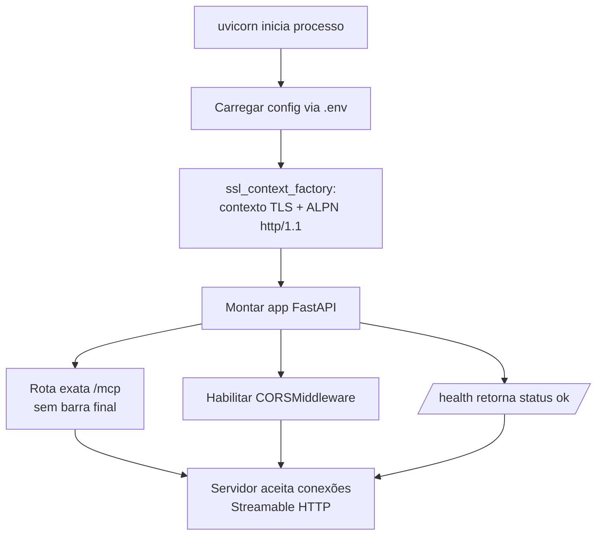

# F1 — FastAPI + MCP Server Setup via Streamable HTTP com TLS

**ID:** F1 · **Prioridade:** 🔴 Crítica · **Esforço Estimado:** 2.5d · **Depende de:** — (primeira feature) · **Status:** 🟩 Done

## 1. Visão

F1 estabelece a camada de transporte do servidor MCP: um processo FastAPI/uvicorn persistente, servindo o protocolo MCP via Streamable HTTP, com TLS obrigatório e negociação ALPN explícita — pré-requisito para que qualquer cliente MCP real (confirmado: Claude Desktop) aceite conectar-se como conector remoto. Sem essa base, nenhuma outra feature do Sprint 1 pode ser testada com clientes reais.

## 2. Objetivo

Ter um servidor FastAPI rodando na porta 3000, acessível via `https://<ip>:3000/mcp`, que conclua o handshake TLS/ALPN e a inicialização de sessão MCP (Streamable HTTP) com sucesso, mesmo sem nenhuma análise ainda cadastrada (F2-F5 vêm depois).

**Métrica de Sucesso:**

- ✅ `openssl s_client -alpn h2,http/1.1 -connect <ip>:3000` reporta ALPN negociado (ex.: `http/1.1`)
- ✅ `curl -k https://localhost:3000/health` responde 200
- ✅ Uma requisição para `https://<ip>:3000/mcp` (sem barra final) não recebe redirect 307
- ✅ Nenhuma mudança de código necessária para trocar de rede local → remota (RNF2, NEGOCIO.md)

## 3. Contexto

**Depende de:** Nenhuma (primeira feature do projeto)

**É dependência de:** F2 (PostgreSQL Adapter), F5 (MCP Tools Integration), e transitivamente de toda a Sprint 1-4 — nenhuma outra feature roda sem o processo FastAPI/MCP no ar.

## 4. Descrição Técnica

### 4.1 Componentes Afetados

Conforme estrutura de pastas do ARQUITETURA.md §5.2, novos nesta feature:

```
analysis_app/
├─ main.py              (novo) — FastAPI app entry point, monta o servidor MCP via Streamable HTTP
├─ config.py            (novo) — Configuração via pydantic-settings (.env)
├─ requirements.txt     (novo) — dependências travadas (ver §7)
├─ certs/               (novo) — certificado TLS local (mkcert) — ver Questão Aberta #4
├─ run_https.py         (novo) — launcher com ssl_context_factory (ALPN), validado no protótipo F0
└─ mcp/
   └─ __init__.py       (novo) — Server de baixo nível + StreamableHTTPSessionManager (transporte);
                          list_tools()/call_tool() aqui ficam com stub vazio/NotImplemented — a lógica
                          real (AnalysisService etc.) entra em F5, não nesta feature
```

Não inclui, nesta feature: `adapters/`, `handlers/`, `services/`, `repositories/`, `schemas/` (entram a partir de F2-F5) e `database/models.py` (a tabela `analyses` só é necessária a partir de F2/F4 — F1 não depende de nenhuma tabela).

### 4.2 Fluxo de Dados (Startup — escopo desta feature)



Este é um subconjunto do fluxo completo de inicialização descrito em ARQUITETURA.md §6.1 (7 passos) — os passos 2 (conectar PostgreSQL), 3 (HandlerRegistry) e 7 completo (`list_tools`/`call_tool` reais) entram a partir de F2, F3 e F5 respectivamente. F1 entrega apenas o transporte (TLS/ALPN/CORS/roteamento) funcionando.

### 4.3 Banco de Dados

N/A — F1 não cria nem depende de nenhuma tabela. A primeira tabela usada (`data_sources`, ARQUITETURA.md §2.2) só entra em F2.

### 4.4 Endpoints/Interfaces

Wiring validado no protótipo F0 (`main.py` anexado por Jose) — para F1, `list_tools()`/`call_tool()` ficam como stub (lista vazia / não implementado); a lógica real de análises entra em F5:

```python
# mcp/__init__.py (ou main.py) — Server de baixo nível + StreamableHTTPSessionManager

import contextlib
from collections.abc import AsyncIterator

from fastapi import FastAPI
from fastapi.middleware.cors import CORSMiddleware
from fastapi.responses import JSONResponse
from mcp.server.lowlevel import Server
from mcp.server.streamable_http_manager import StreamableHTTPSessionManager
from mcp.types import TextContent, Tool

mcp_server = Server("analysis-mcp", instructions="...")


@mcp_server.list_tools()
async def list_tools() -> list[Tool]:
    return []  # stub nesta feature — análises reais entram em F5


@mcp_server.call_tool()
async def call_tool(name: str, arguments: dict) -> list[TextContent]:
    raise NotImplementedError("Nenhuma análise cadastrada ainda — ver F5")


session_manager = StreamableHTTPSessionManager(app=mcp_server)


class _MCPExactPathASGI:
    """Encaminha para handle_request sem passar por Route(request)->Response.

    Necessário porque Starlette trata funções/métodos passados a `add_route`
    como `func(request) -> Response`; `handle_request` é ASGI puro
    `(scope, receive, send)`. Um objeto com `__call__` escapa dessa checagem.
    """

    async def __call__(self, scope, receive, send) -> None:
        await session_manager.handle_request(scope, receive, send)


@contextlib.asynccontextmanager
async def lifespan(app: FastAPI) -> AsyncIterator[None]:
    # FastAPI não propaga o lifespan de sub-apps montadas automaticamente —
    # o session_manager.run() precisa ser aberto/fechado manualmente aqui.
    async with session_manager.run():
        yield


app = FastAPI(lifespan=lifespan)
app.add_middleware(
    CORSMiddleware,
    # Clientes MCP desktop (Electron) podem validar o conector via fetch() no
    # processo de renderer, sujeito a CORS — sem isso, a checagem falha com um
    # erro genérico de "sem resposta", mesmo o servidor respondendo normalmente.
    allow_origins=["*"],  # confirmado: rede interna, todas origens liberadas
    allow_methods=["GET", "POST", "DELETE", "OPTIONS"],
    allow_headers=["*"],
    expose_headers=["Mcp-Session-Id"],
)
app.add_route("/mcp", _MCPExactPathASGI())  # "/mcp" exato, sem redirect 307
app.mount("/mcp", session_manager.handle_request)  # "/mcp/..." (qualquer sub-path)


@app.get("/health")
async def health() -> JSONResponse:
    return JSONResponse({"status": "ok"})  # confirmado: apenas isso nesta feature
```

```python
# run_https.py — launcher com ALPN, validado no protótipo F0 (anexo de Jose)

import uvicorn
from uvicorn.config import Config


def alpn_ssl_context_factory(config: Config, default_factory):
    context = default_factory()
    context.set_alpn_protocols(["http/1.1"])
    return context


if __name__ == "__main__":
    uvicorn.run(
        "main:app",
        host="0.0.0.0",
        port=3000,
        ssl_keyfile="certs/localhost+2-key.pem",
        ssl_certfile="certs/localhost+2.pem",
        ssl_context_factory=alpn_ssl_context_factory,
    )
```

> A CLI padrão do uvicorn (`--ssl-keyfile`/`--ssl-certfile`) não negocia ALPN — confirmado com `openssl s_client -alpn h2,http/1.1` ("No ALPN negotiated"). Clientes com stack TLS mais estrita (ex.: Electron/Chromium do Claude Desktop) podem abortar a conexão sem nunca chegar a enviar uma requisição HTTP nesse caso. `run_https.py` resolve isso subindo o uvicorn programaticamente com `ssl_context_factory`.

## 5. Critérios de Aceitação

```gherkin
Feature: FastAPI + MCP Server Setup via Streamable HTTP com TLS

Scenario: Handshake TLS/ALPN bem-sucedido
  Given o certificado TLS local (mkcert) está instalado e configurado
  When um cliente testa "openssl s_client -alpn h2,http/1.1 -connect <ip>:3000"
  Then o servidor negocia ALPN e retorna "http/1.1" (ou "h2")

Scenario: Endpoint /mcp sem barra final não gera redirect
  Given o servidor está no ar
  When um cliente faz uma requisição para "https://<ip>:3000/mcp" (sem barra final)
  Then a resposta NÃO é um redirect 307

Scenario: Health check responde
  Given o servidor está no ar
  When um cliente faz GET "https://<ip>:3000/health"
  Then a resposta é 200 com {"status": "ok"}

Scenario: Conexão HTTP simples (sem TLS) não é servida
  Given o servidor está configurado apenas para HTTPS (T4, NEGOCIO.md)
  When um cliente tenta "http://<ip>:3000/mcp"
  Then a conexão não é aceita (rede interna não dispensa TLS — RNF5, NEGOCIO.md)
```

## 6. Testes

### 6.1 Testes Unitários

```python
class TestServerSetup:
    def test_health_check_returns_ok(self):
        ...

    def test_mcp_route_no_redirect_without_trailing_slash(self):
        ...

    def test_cors_middleware_configured(self):
        ...
```

### 6.2 Checklist de Testes

- [x] Teste unitário: /health retorna 200
- [x] Teste unitário: /mcp sem barra final não redireciona
- [x] Teste de integração: handshake TLS/ALPN via `openssl s_client`
- [x] Manual: testar via pelo menos 1 cliente MCP real (Claude Desktop) conectando ao endpoint https — confirmado por Jose (2026-09-23)

## 7. Mudanças na Configuração

**Variáveis de Environment (.env):**

```
SERVER_HOST=0.0.0.0
SERVER_PORT=3000
TLS_CERT_FILE=certs/server.pem
TLS_KEY_FILE=certs/server-key.pem
```

**requirements.txt (dependências desta feature, ARQUITETURA.md §5.1):**

```
fastapi
uvicorn[standard]
pydantic
pydantic-settings
mcp>=1.9.0,<2.0.0
```

> Sem versão exata fixada para fastapi/uvicorn de propósito (ver nota em ARQUITETURA.md §5.1 — conflito de dependências transitivas com `mcp` observado no protótipo F0). Apenas `mcp` tem teto de versão obrigatório.

## 8. Documentação

### 8.1 Como a feature aparece no MCP

Nenhuma ferramenta (`tool`) é exposta ainda nesta feature — `list_tools()` pode retornar lista vazia. A integração real de tools é F5.

### 8.2 Como o usuário usa essa feature

Nenhum uso direto por usuário final — é infraestrutura. Jose valida via `curl`/`openssl` e configuração de um cliente MCP apontando para `https://<ip>:3000/mcp`.

### 8.3 Como outros desenvolvedores estenderão isso

O `ssl_context_factory` e a rota exata `/mcp` são a base fixa sobre a qual F5 registrará os handlers reais de `list_tools()`/`call_tool()`.

## 9. Checklist de Implementação

**Código:**

- [x] main.py com FastAPI + ssl\_context\_factory (ALPN) + mount/rota exata /mcp + CORS
- [x] config.py (.env via pydantic-settings)
- [x] requirements.txt travado conforme §7
- [x] Certificado TLS local gerado (mkcert)
- [ ] Code review completo
- [x] Testes passing (100% dos casos)
- [x] Docstrings

**QA:**

- [x] Handshake TLS/ALPN confirmado via `openssl s_client`
- [ ] Code review aprovado
- [ ] PR merge aprovado

> Código, testes automatizados e teste manual com cliente real (Claude Desktop) concluídos e validados. Os 3 itens acima permanecem em aberto de propósito — são etapas de processo (revisão por pessoa e merge do PR) que dependem de ação do Jose, não deste agente.

## 10. Questões Abertas para o Jose

Antes de implementar, preciso confirmar (regra de ouro — não inventar):

1. **Wiring do `Server` de baixo nível com Streamable HTTP + FastAPI:** os documentos aprovados descrevem o resultado esperado (ADR-006: decorators `list_tools()`/`call_tool()` da classe `Server`, sessão Streamable HTTP montada) mas não incluem o código real de `run_https.py` do protótipo F0. Você tem esse arquivo (`F0_PROTOTIPO_MCP_MEMORIA.md` / `mcp_prototype/`) para eu seguir o padrão já validado, ou devo montar a partir da API pública do SDK `mcp`?
2. 1b. ~~**Atualização**~~ → **Resolvido:** Jose enviou o `main.py` real do protótipo F0, com o wiring completo (`Server` de baixo nível + `StreamableHTTPSessionManager` + rota exata/mount + lifespan manual + CORS com `expose_headers=["Mcp-Session-Id"]`). Código replicado em 4.1 e 4.4 abaixo.
3. ~~**CORS — origens permitidas:**~~ Confirmado por Jose: `*` (rede interna confiável).
4. ~~**IP(s) da máquina para o certificado mkcert:**~~ Parcialmente resolvido: Jose confirmou que, por enquanto, é só um certificado local (mkcert) para desenvolvimento/testes — a CA interna para múltiplas máquinas fica para quando a arquitetura de produção (NGINX) for formalizada (ver item abaixo). Falta só o IP real da máquina de dev para gerar o certificado.
5. ~~**Local de `certs/` na estrutura de pastas:**~~ Confirmado por Jose: `analysis_app/certs/`.
6. ~~**Escopo do `/health` nesta feature:**~~ Confirmado por Jose: apenas `{"status": "ok"}` nesta feature, evoluindo o endpoint incrementalmente em F2-F4.
7. **TLS em produção via NGINX (novo, trazido por Jose):** o MCP server rodaria atrás de um NGINX que termina TLS em produção (com certificado de produção), enquanto o `mkcert` seria usado só localmente para desenvolvimento/testes. Isso é diferente do que o ADR-006 descreve hoje (TLS/ALPN implementado diretamente no `uvicorn`/FastAPI via `ssl_context_factory`, sem proxy reverso). Para F1 (ambiente de dev/rede interna), vou seguir exatamente o documentado — TLS/ALPN no próprio processo FastAPI, com mkcert. A arquitetura de produção com NGINX fica registrada como decisão futura, fora do escopo de F1 — quer que eu já anote essa nota em ARQUITETURA.md agora, ou prefere formalizar isso quando chegarmos no roadmap de produção (V1.2)?
